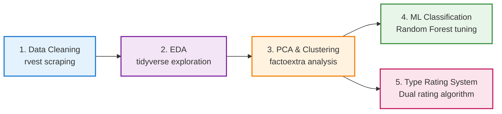

# The Story and Mystery of Pokémon — Data Science Project

# !!**Note: Please check the website or the docs folder for the latest data.**!!

<div align="center">

<!-- Hero Banner with animated GIFs - varying sizes for visual hierarchy -->


<!--  -->
<!-- 
 -->


<br> <br>
[](https://www.r-project.org/)
[](https://github.com/PineappleEater/P8105---Final-Project-Pokemon)
[](LICENSE)

*A comprehensive data science exploration of Pokémon attributes, battle stats, and design patterns across nine generations*

[Overview](#overview) · [Dataset](#dataset) · [Methods](#methodology) · [Results](#key-findings) · [Usage](#installation--usage) · [Team](#team)

</div>

---

## Overview


This repository presents a comprehensive data science investigation into the Pokémon universe, analyzing **1,025+ Pokémon species** across all nine generations. The project employs modern statistical and machine learning techniques to uncover patterns in Pokémon design, classify legendary Pokémon, and identify distinct battle archetypes.

<br clear="right">

### Project Goals

**Core Research Questions**

1. **Pokémon Base Data Analysis**: Is there any pattern in the distribution of Pokémon types and stats?
2. **Physical Attributes Analysis**: Do Pokémon ecosystems or their height-weight distributions have any real-world analogues?
3. **Type Effectiveness**: Which type (or type combination) is the strongest overall? Which is the weakest?
4. **Legendary Classification**: Is it possible to build a classifier to identify legendary Pokémon?
5. **Rating System Development**: Based on Pokémon type and stats, can we provide a Pokémon rating system for beginners?

### Academic Context

- **Course**: P8105 — Data Science I (Columbia University)
- **Timeline**: November – December 2025
- **Final Deliverables**: Analysis reports, trained models, presentation materials

---

## Dataset

### Data Sources

| Source | Description | URL |
|--------|-------------|-----|
| **PokémonDB** | Complete Pokémon Stats and Physical Attributes scraped from web | (<a href="https://pokemondb.net/pokedex/all">Complete Pokémon Pokédex</a>)(<a href="https://pokemondb.net/pokedex/stats/height-weight">List of Pokémon by height and weight</a>) |
| **BULBAGARDEN** | "Fully evolved Pokémon only list" scraped from web | (<a href="https://bulbapedia.bulbagarden.net/wiki/List_of_fully_evolved_Pok%C3%A9mon_by_base_stats">Fully evolved Pokémon List</a>) |

### Dataset Overview

<div align="center">

| Metric | Value |
|--------|-------|
| **Species Count** | 1,025 Pokémon |
| **Generations** | Gen 1–9 (1996–2025) |
| **Features** | 30+ attributes |

</div>

### 18 Pokémon Types

<div align="center">


</div>

| Variable | Type | Description |
|----------|------|-------------|
| `dex` | Integer | National Pokédex number |
| `name` | String | Official species name |
| `type_1` / `type_2` | Categorical | Primary and secondary types |
| `total` | Integer | Base Stat Total (BST) |
| `hp` ... `speed` | Integer | Individual base stats |
| `is_legendary` | Boolean | Legendary status flag |
| `is_special` | Boolean | Legendary status flag |
| `category` | Factor | Regular / Legendary / Mythical / Paradox / Ultra Beast |
| `generation` | character | Pokémon Game Generation Number |
| `is_dual_type` | Boolean | Dual Type Identifier |

---

## Methodology

### Analysis Pipeline



# !!**Note: Please check the website or the docs folder for the latest data.**!!

### 1. Data Cleaning & Preprocessing


**File**: `1-datacleaning.Rmd`

- Scraped three HTML tables from PokémonDB using `rvest`
- Joined stats, height/weight, and evolution data
- Handled special cases (Eternamax, alternate forms)
- **Output**: `pokemon_data.csv` (1,025 rows × 14 columns)

### 2. Exploratory Data Analysis


**File**: `2-eda.Rmd`

- Feature engineering (binary flags, generation labels)
- One-hot encoded all 18 types
- Correlation analysis & distribution plots
- **Output**: `pokemon_data_enriched.csv` (30+ features)

### 3. PCA & Clustering Analysis


**File**: `3-pca_clustering.Rmd`

- Principal Component Analysis on 9 numeric features
- K-Means clustering (k=4 optimal)
- **Variance Explained**: First 3 PCs capture ~70%

**Cluster Profiles**:

| Cluster | Label | Avg BST | % Legendary |
|---------|-------|---------|-------------|
| 1 | High-Power Sweepers | 580 | 35% |
| 2 | Defensive Tanks | 480 | 8% |
| 3 | Balanced All-Rounders | 450 | 2% |
| 4 | Low-Power / Early-Game | 320 | 0% |

### 4. Classification Models


**File**: `4-classification_legendary.Rmd`

**Task**: Binary classification — predict `is_legendary`

| Model | AUC | Accuracy | F1 |
|-------|-----|----------|-----|
| Logistic Regression | 0.985 | 0.94 | 0.85 |
| Decision Tree | 0.972 | 0.91 | 0.79 |
| Random Forest | 0.992 | 0.96 | 0.90 |
| **RF Tuned** | **0.995** | **0.97** | **0.92** |

### 5. Type Effectiveness & Dual Rating System


**File**: `5-rating_system.Rmd`

**Dual Rating System** (100-point scale each):

**Offensive Rating (100 pts)**:

- BST Score (40 pts): S-curve mapping for smooth strength scaling
- Offensive Stats (60 pts):
  - Effective Attack Power (50%): Recognizes mixed vs specialized attackers
  - Effective Speed Score (40%): Values both fast and slow tactical play
  - Durability Buffer (10%): Minimum survivability requirement

**Defensive Rating (100 pts)**:

- BST Score (40 pts): Shared base stat evaluation
- Defensive Stats (30 pts):
  - Durability (80%): HP × √(Def × SpDef) — penalizes unbalanced defenses
  - Counter-Attack (20%): Maintains offensive threat
- Type Advantage (30 pts): Defensive type matchup score

**Tier Assignment**:

- **SS**: Elite (Off ≥75 or Def ≥65)
- **S**: Strong (Off ≥65 or Def ≥55)
- **A**: Above Average (Off ≥55 or Def ≥45)
- **B**: Average (Off ≥45 or Def ≥35)
- **C**: Below Average (Off ≥35 or Def ≥25)
- **F**: Weak

**Role Classification**:

- **Offensive**: Off/Def ratio ≥ 1.15
- **Balanced**: 0.85 < Off/Def ratio < 1.15
- **Defensive**: Off/Def ratio ≤ 0.85

---

## Key Findings

### Legendary Pokémon

<div align="center">


</div>

1. **Statistically Distinct**: Mean BST Legendary (680) vs Regular (420), *p* < 0.001
2. **99% Separable** by Random Forest classifier
3. **Type Concentration**: Dragon & Psychic over-represented (30% vs 5%)

### Type Distribution

| Most Common | Legendary Favorites |
|-------------|---------------------|
| Water (18%) | Dragon (30%) |
| Normal (15%) | Psychic (25%) |
| Grass (12%) | Steel (20%) |

### Machine Learning Results

- **Best Model**: Tuned Random Forest (AUC = 0.995)
- **Top Features**: Total BST, Attack, Sp. Attack, Speed, HP

---

## Repository Structure

```
P8105---Final-Project-Pokemon/
│
├── data/                    # Datasets
│   ├── raw-data/            # Scraped HTML inputs
│   ├── analysis/            # Analysis outputs (PCA, clustering, type)
│   └── *.csv                # Processed datasets
│
├── models/                  # Trained ML models (.rds)
│   └── legendary_classifier_rf_tuned.rds  # Best model
│
├── reports/                 # HTML analysis reports
│
├── assets/                  # Image assets for UI
│   ├── artwork/             # Official artwork (978 files)
│   ├── sprites/
│   │   ├── gif/             # Animated GIFs (1,176 files)
│   │   ├── gif-shiny/       # Shiny GIFs (941 files)
│   │   ├── home/            # Pokemon Home 3D (982 files)
│   │   ├── home-shiny/      # Pokemon Home Shiny (982 files)
│   │   ├── gen1-classic/    # Gen 1 pixel sprites (149 files)
│   │   ├── gen2-crystal/    # Gen 2 Crystal sprites (249 files)
│   │   └── sv-icons/        # Scarlet/Violet icons (982 files)
│   └── icons/types/         # 18 type icons
│
├── scripts/
│   └── download_pokemon_assets.R  # Asset downloader
│
└── *.Rmd                    # Analysis notebooks
```

---

## Installation & Usage

### Prerequisites

- **R** (≥ 4.0.0) — [Download](https://cran.r-project.org/)
- **RStudio** — [Download](https://posit.co/downloads/)

### Required Packages

```r
install.packages(c(
  "tidyverse", "rvest", "janitor", "knitr", "rmarkdown",
  "corrplot", "patchwork", "kableExtra", "plotly",
  "factoextra", "FactoMineR", "cluster",
  "caret", "randomForest", "rpart", "pROC"
))
```

### Quick Start

```bash
# Clone repository
git clone https://github.com/PineappleEater/P8105---Final-Project-Pokemon.git
cd P8105---Final-Project-Pokemon

# Open in RStudio and render analyses
```

### Download Assets (Optional)

```r
source("scripts/download_pokemon_assets.R")
```

---

## Team

<div align="center">

| Name | UNI | Role |
|------|-----|------|
| **Ruipeng Li** | rl3616 | Data Cleaning, EDA, Rating System |
| **Xuange Liang** | xl3493 | Modeling, Rating System |
| **Yiwen Zhang** | yz4994 | Visualization, Documentation |
| **Leah Li** | yl5828 | Visualization, Documentation |

</div>

---

## Acknowledgements

- **Data Sources**: Rounak Banik (Kaggle), PokémonDB, Veekun/PokéAPI
- **Inspiration**: Game Freak / Nintendo, P8105 course staff
- **Tools**: R Core Team, tidyverse developers, RStudio

---

## License & Citation

**Academic Use**: This project was completed for educational purposes (P8105 coursework)

**Citation**:

```
Li, L., Li, R., Liang, X., & Zhang, Y. (2025).
The Story and Mystery of Pokémon: A Data Science Analysis.
Columbia University P8105 Final Project.
https://github.com/PineappleEater/P8105---Final-Project-Pokemon
```

---

<div align="center">

<!-- Eeveelutions with animated GIFs - varying sizes -->


<br><br>
**If you found this project helpful, please consider starring the repository!**

Made with ❤️ by the P8105 Pokémon Research Team

*Gotta Analyze 'Em All!*

</div>
